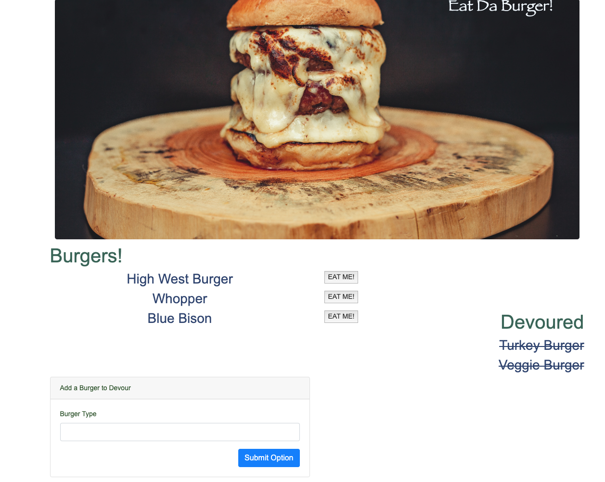

# Eat Da Burger

### Overview

A restaurant app that lets users input the names of burgers they'd like to eat and lets the users devour them.
Heroku link https://quiet-harbor-06430.herokuapp.com/
Portfolio link https://danalittleskier.github.io/Portfolio/

### Technologies

This application is a an example of MVC design patter which uses MySQL, Node, Express, Handlebars and a homemade ORM and it is deployed to Heroku and uses their database.

* [MySql] https://www.npmjs.com/package/mysql
* [Express] https://www.npmjs.com/package/express
* [Handlebars] https://www.npmjs.com/package/handlebars
* [Heroku] https://heroku.com

### Screenshot

### GitHub Link

https://github.com/danalittleskier/burger

### Role

Dana Alexandrescu - developer